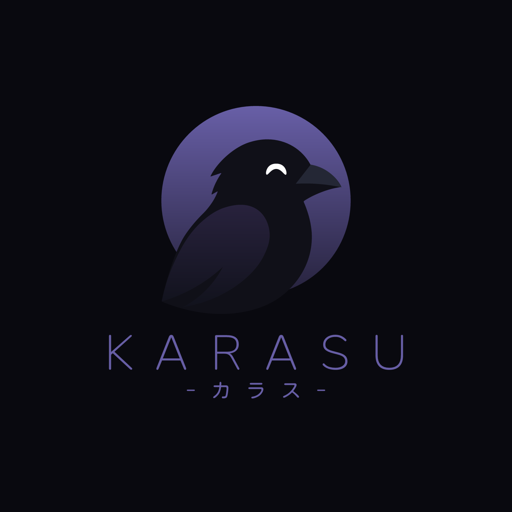
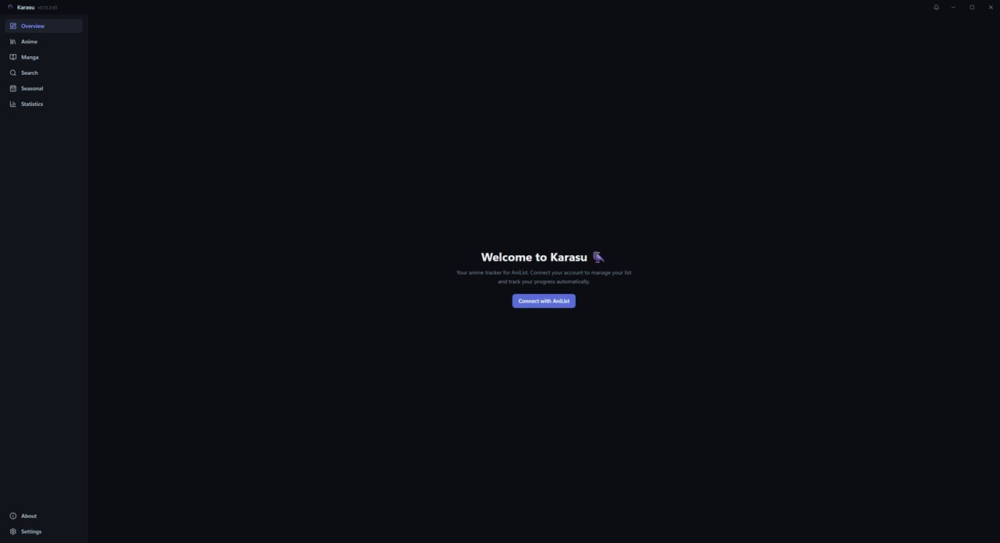
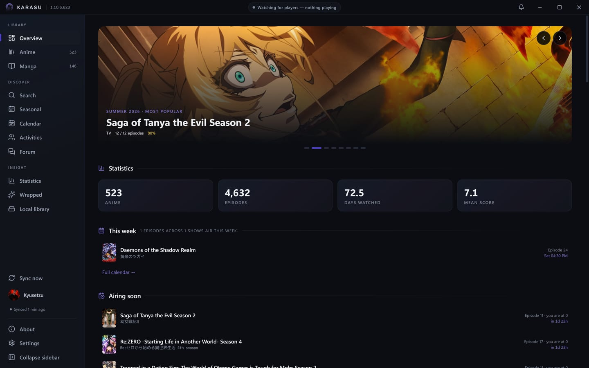
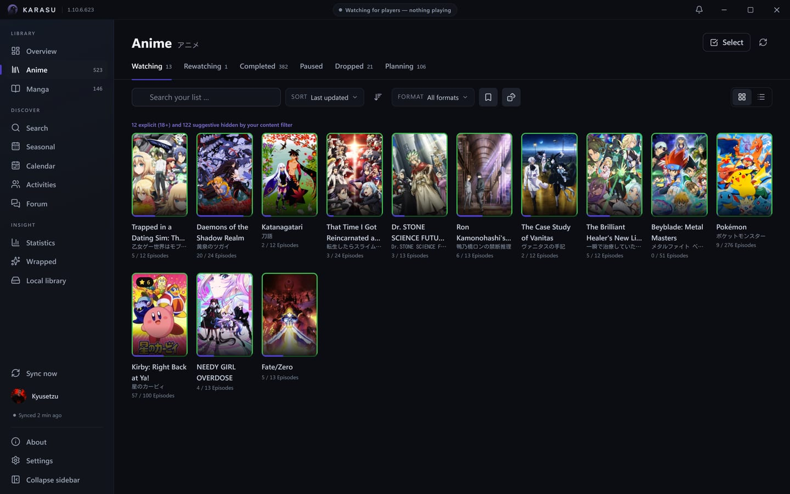
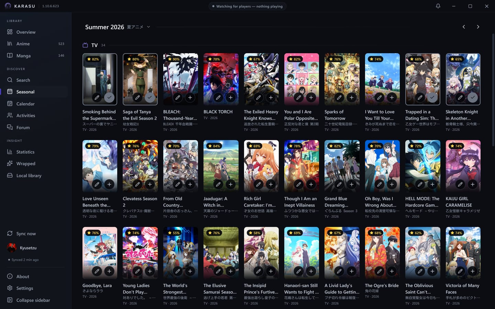
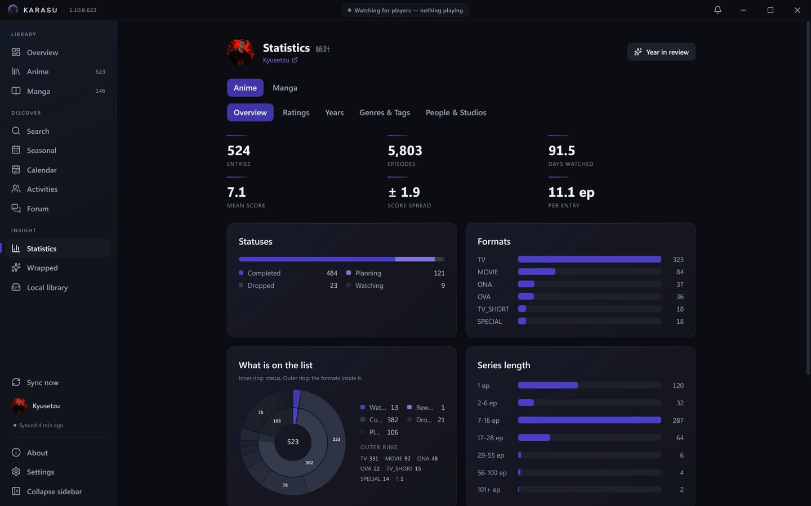
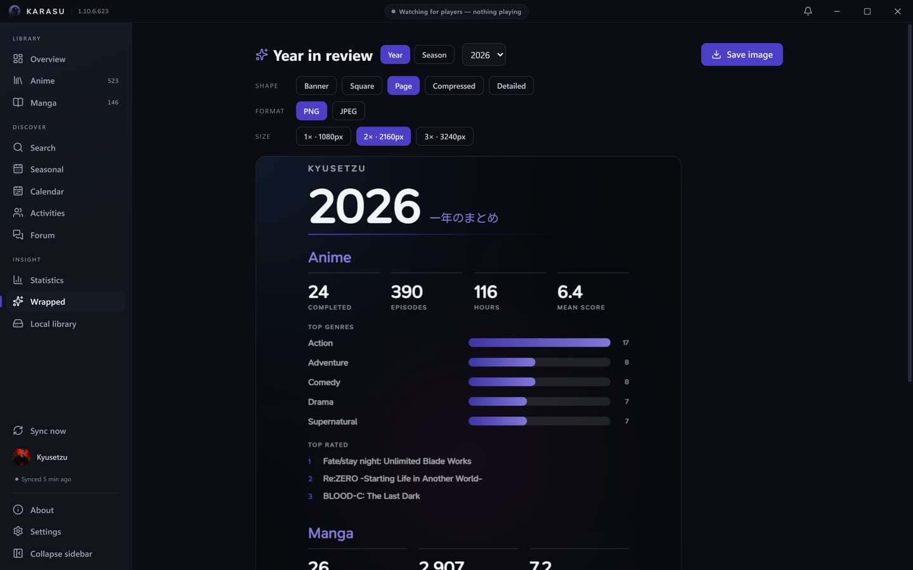
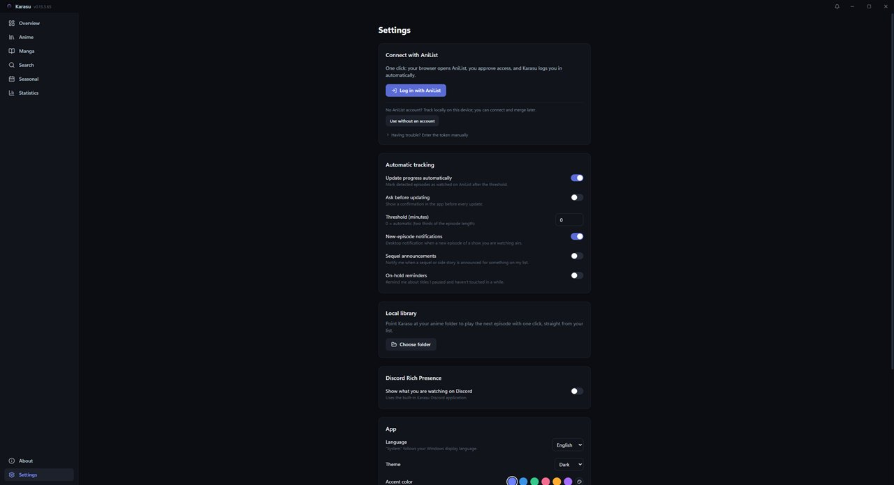

<p align="center">
  
</p>

<h1 align="center">Karasu</h1>

<p align="center">
  A modern anime &amp; manga tracker — built exclusively for <a href="https://anilist.co">AniList</a>.
</p>

<p align="center">
  <a href="https://github.com/Kyusetzu/Karasu/actions/workflows/ci.yml"></a>
  
  
  <a href="LICENSE"></a>
  
  <a href="https://discord.gg/yeHNSGyM8F"></a>
</p>

---

## What is Karasu?

Karasu watches your list for you. Play an episode in your video player, read a
chapter in your browser, and Karasu recognizes it and updates your AniList
progress automatically — no buttons to press. It lives in your system tray,
speaks English and German, and is built as a small native app with Tauri, React
and Rust.

It's inspired by the wonderful [Taiga](https://github.com/erengy/taiga).

## Why use it over the website?

Because a desktop app can do things anilist.co simply can't:

- **It knows what you're actually watching.** Local players and browser tabs are
  detected and scrobbled for you.
- **It plays your files.** Point it at your anime folder and launch the next
  unwatched episode with one click, straight from your list.
- **It keeps you in the loop.** Desktop notifications and a bundled notification
  centre for new episodes, announced sequels, and titles you've left on hold.
- **It shows up on Discord.** Rich Presence that reflects what you're doing,
  always on.
- **It works without an account, too.** A fully local list on your device, with
  a one-time merge into AniList whenever you decide to connect.

## Screenshots

<p align="center">
  <br />
  <sub>First launch — connect with AniList, or start local-only</sub>
</p>

<table>
<tr>
<td width="50%"><br /><sub>Overview — this week's airing, continue watching, stats at a glance</sub></td>
<td width="50%"><br /><sub>Anime list — grid view with status tabs and filters</sub></td>
</tr>
<tr>
<td width="50%"><br /><sub>Seasonal — browse a season's chart</sub></td>
<td width="50%"><br /><sub>Statistics — genres, tags, voice actors, studios and more</sub></td>
</tr>
<tr>
<td width="50%"><br /><sub>Year in review — a shareable card, exportable as a PNG</sub></td>
<td width="50%"><br /><sub>Settings — themes, accent colours, detection and update preferences</sub></td>
</tr>
</table>

## Features

**Tracking &amp; scrobbling**
- Automatic detection in local players (mpv, VLC, MPC-HC/BE, PotPlayer, SMPlayer)
  and in the browser (Crunchyroll and more)
- Manga reading detection (MangaDex, MANGA Plus, Comick, Bato, MangaFire, Asura Scans)
- **Windows media-session detection** for players that report to the system
  media controls instead of writing the title into their window — Jellyfin
  Media Player, Plex and browser video
- **Jellyfin server integration** (optional) — ask your server instead of
  guessing from a window title, and it reports the series, season and episode
  as exact fields rather than a filename to parse. Sign in with your ordinary
  Jellyfin account (no administrator rights, no API key); the server then only
  ever reports your own playback, so nobody else on a shared server ends up on
  your list. Your password is exchanged once for an access token and never
  stored
- Automatic scrobbling after a configurable threshold, with optional
  confirmation, episode-gap protection and
  [anime-relations](https://github.com/erengy/anime-relations) episode redirects

**Lists &amp; editing**
- Anime and manga lists with status tabs, grid/list views and an **offline queue**
  that syncs once you're back online
- Taiga-style quick editing (progress/score dropdowns, +1, one-click *Completed*)
  and a shared edit dialog straight from search results
- **Bulk multi-select** edits, saved **filter/sort presets**, a **random pick**,
  private **notes**, custom **tags** (with a tag filter), and a
  **rewatch/reread counter**

**Discovery**
- Search with an anime/manga toggle, seasonal charts, rich detail pages
- **Recommendations** for anime and manga on the dashboard, built from the
  titles you've completed — the higher you scored something, the more its
  suggestions count, and anything already on your list is left out
- **Franchise graph** — the whole franchise as a relation map (sequels, side
  stories, cross-medium sources/adaptations), each node coloured by your status

**Insights**
- **Statistics** — AniList profile stats (genres, tags, voice actors, studios,
  staff) for both anime and manga
- **Year in review** — a shareable card of your year, exportable as a PNG
- Time-to-finish estimates and a Dashboard "this week" digest

**Notifications**
- New-episode desktop toasts, opt-in **sequel-announcement** alerts and
  **on-hold reminders**
- A bundled in-app **notification centre** (the bell in the title bar) with
  read / mark-all-read

**Integrations &amp; flexibility**
- **Local library** with *play next episode* in your default player
- **Discord Rich Presence**, always on, with a link back to the project
- **Local-only mode** (no account needed) with a later sign-in merge
- **Portable mode** — keep everything in a folder next to the executable

**Personalisation**
- Light / dark themes and a full **accent colour picker** (text stays readable
  on any colour)
- Command palette (<kbd>Ctrl</kbd>+<kbd>K</kbd>), an app-appropriate in-app
  right-click menu, system tray, single instance, autostart
- English / German with automatic system-language detection
- One-click AniList login and a built-in *Check for updates*

## Installation

Download the installer (`Karasu_<version>_x64-setup.exe`) from the
[releases page](https://github.com/Kyusetzu/Karasu/releases) and run it. Each
release carries exactly one installer — the newest build.

On first start, open **Settings → Log in with AniList** — your browser opens
AniList, you approve access, and Karasu logs you in automatically. (A manual
token paste is available as a fallback.) You can also pick **Use without an
account** to track locally and connect later.

> **About the SmartScreen warning.** The installer is **unsigned** — Karasu
> is a small solo-maintained project, and a Windows code-signing certificate
> costs money that doesn't currently make sense here. On first run, Windows
> SmartScreen may show a "Windows protected your PC" prompt (**More info →
> Run anyway** to continue). If you want to verify the download before
> running it, every release ships a `SHA256SUMS.txt` checksum and a
> [VirusTotal](https://www.virustotal.com) scan result linked right in its
> release notes. Karasu's own built-in updater (Settings, or the About page)
> independently verifies every update it installs against its own signing
> key, regardless of SmartScreen.

> **Platforms.** Windows is the supported target. Linux (Ubuntu) support is
> experimental groundwork: the app compiles and its tests run on Linux in CI,
> but window detection and encrypted portable-token storage are not implemented
> there yet, and no Linux build is published.

## Development

Prerequisites: [Node.js](https://nodejs.org) ≥ 22.22, [Rust](https://rustup.rs)
(MSVC toolchain on Windows), VS Build Tools with the C++ workload, WebView2
(included in Windows 11). On Ubuntu, install `libwebkit2gtk-4.1-dev`,
`libgtk-3-dev`, `libayatana-appindicator3-dev` and `librsvg2-dev`.

```sh
npm install
npm run tauri dev    # development build with hot reload
npm run tauri build  # release build + installer (NSIS on Windows)

npm run typecheck    # TypeScript
npm test             # frontend unit tests (vitest)
cargo test --manifest-path src-tauri/Cargo.toml   # backend tests
```

**Versioning.** Every commit bumps a four-part version
`MAJOR.MINOR.PATCH.COMMIT#` (breaking / feature / fix / commit counter); the
running version is shown in the About window.

### Architecture

| Layer | Technology |
|---|---|
| Shell | Tauri 2 (Rust backend, WebView2) |
| Frontend | React 19 + TypeScript + Vite + Tailwind CSS v4 |
| State | TanStack Query (server), Zustand (client), i18next (i18n) |
| Storage | SQLite via rusqlite (cache, offline queue, local list, notifications, settings); tokens in the OS credential store (Windows Credential Manager, Secret Service on Linux) |
| Detection | Win32 window enumeration + Windows media sessions (SMTC), with an optional Jellyfin `/Sessions` source; titles resolved by a custom release-name parser (Anitomy equivalent) |

### Shared application IDs

Karasu ships with a built-in AniList client ID and Discord application ID (see
`BUILTIN_ANILIST_CLIENT_ID` in `src-tauri/src/commands.rs` and
`BUILTIN_DISCORD_APP_ID` in `src-tauri/src/discord/mod.rs`), so users don't need
to register anything themselves. Discord uses the built-in application. If you
build with your own AniList API client, set its redirect URL to
`http://localhost:46231/callback` so the one-click login works.

## Built with AI

Karasu is developed with heavy assistance from AI coding tools — primarily
[Claude Code](https://claude.com/claude-code) (Anthropic's Claude models). AI is
used across the codebase: writing and refactoring features, tests and
documentation, and reviewing changes. Every change is directed, reviewed and
verified by a human maintainer before it lands, and the same checks apply to
AI-written and hand-written code alike (`typecheck`, `vitest`, `cargo test`, and
a build smoke check per commit). The repository-level [`CLAUDE.md`](CLAUDE.md)
documents the conventions and guardrails these tools follow.

## Contact

Bug reports and pull requests belong on
[GitHub Issues](https://github.com/Kyusetzu/Karasu/issues) — that's where they
get tracked. For everything else:

- Discord server: [**Kyu's Cozy Corner**](https://discord.gg/yeHNSGyM8F)
- Discord: **Kyusetzu**
- Email: **contact@kyusetzu.de**

Security issues go to the email above, privately — see
[SECURITY.md](SECURITY.md).

## Star History

<a href="https://www.star-history.com/?type=date&repos=Kyusetzu%2FKarasu">
 <picture>
   <source media="(prefers-color-scheme: dark)" srcset="https://api.star-history.com/chart?repos=Kyusetzu/Karasu&type=date&theme=dark&legend=top-left&sealed_token=Jj6NQBXfw0uCgsX0uOjYYviVyxJGU2VSphsY9y7GfRGt4XL9iKWk5UyamsuCP_pta5oWa_O-SpBO14_yzZ5mGs0K1BcXOc_S7t856ox8E_nTpBZ1KvwgjKNczjPo4B0eCET3tE1Iuieo_oGZ9_B2-u5Zk6b1V5aGx8F-qOBj9ZelUGqsE59CdhITcMZ4" />
   <source media="(prefers-color-scheme: light)" srcset="https://api.star-history.com/chart?repos=Kyusetzu/Karasu&type=date&legend=top-left&sealed_token=Jj6NQBXfw0uCgsX0uOjYYviVyxJGU2VSphsY9y7GfRGt4XL9iKWk5UyamsuCP_pta5oWa_O-SpBO14_yzZ5mGs0K1BcXOc_S7t856ox8E_nTpBZ1KvwgjKNczjPo4B0eCET3tE1Iuieo_oGZ9_B2-u5Zk6b1V5aGx8F-qOBj9ZelUGqsE59CdhITcMZ4" />
   
 </picture>
</a>

## License

[MIT](LICENSE)
