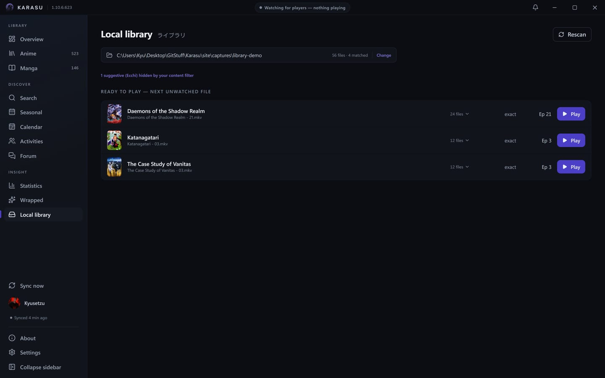
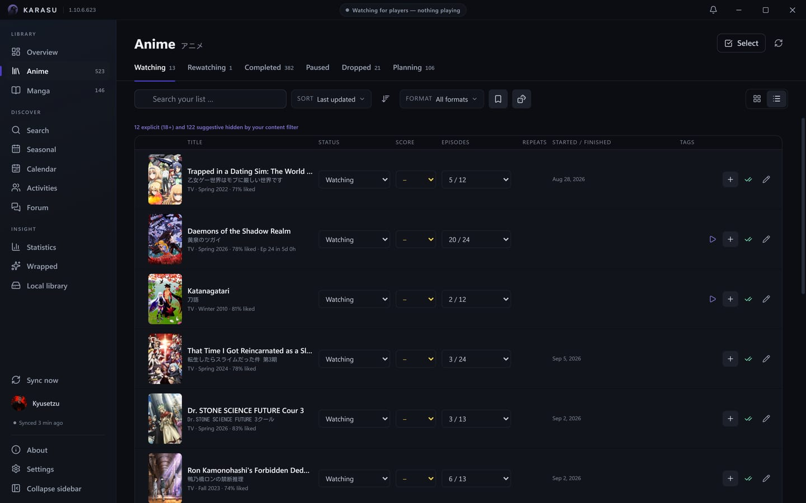
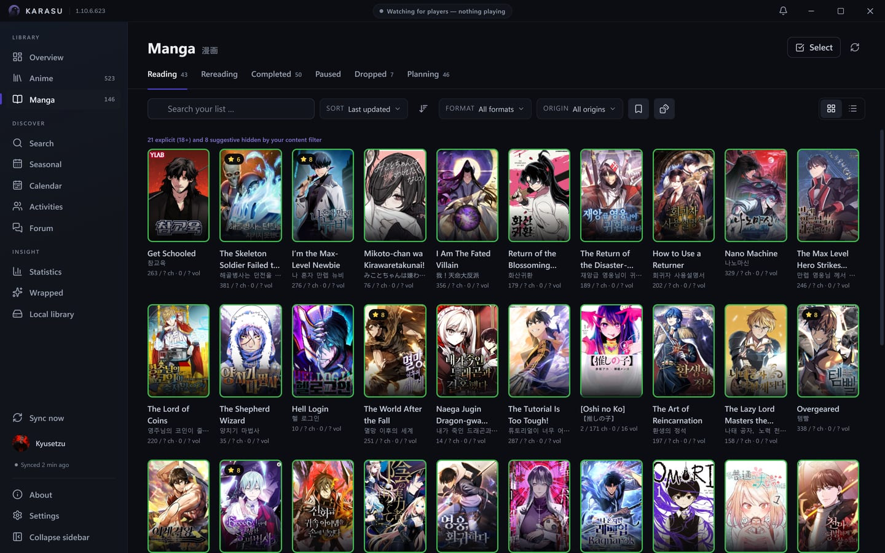
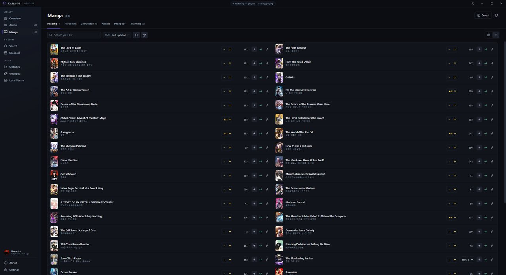

<p align="center">
  
</p>

<h1 align="center">Karasu</h1>

<p align="center">
  A modern anime &amp; manga tracker — built exclusively for <a href="https://anilist.co">AniList</a>.
</p>

<p align="center">
  <a href="https://github.com/Kyusetzu/Karasu/actions/workflows/release.yml"></a>
  
  
  
  <a href="LICENSE"></a>
  
  <a href="https://discord.gg/yeHNSGyM8F"></a>
</p>

---

## What is Karasu?

Karasu watches your list for you. Play an episode in your video player, read a
chapter in your browser, and Karasu recognizes it and updates your AniList
progress automatically — no buttons to press. It lives in your system tray
where your desktop has one,
speaks English and German, and is built as a small native app with Tauri, React
and Rust — for Windows, Linux and, as a sideloaded APK, Android, where the same
app trades the tray for a bottom navigation bar.

It's inspired by the wonderful [Taiga](https://github.com/erengy/taiga).

## Why use it over the website?

Because a local app can do things anilist.co simply can't:

- **It knows what you're actually watching.** Local players and browser tabs are
  detected and scrobbled for you.
- **It plays your files.** Point it at your anime folder and launch the next
  unwatched episode with one click, straight from your list.
- **It keeps you in the loop.** Desktop notifications and a bundled notification
  centre for new episodes, announced sequels, and titles you've left on hold.
- **It shows up on Discord.** Rich Presence that reflects what you're doing,
  always on.
- **It works without an account, too.** A fully local list on your device —
  editing, statistics, export and import all work offline — with a one-time
  merge into AniList whenever you decide to connect. Two things do need an
  account, because they have nothing to match against without one: automatic
  scrobbling and the local library scan.

## Screenshots

<p align="center">
  <br />
  <sub>First launch — connect with AniList, or start local-only</sub>
</p>

<table>
<tr>
<td width="50%"><br /><sub>Overview — what's airing this week, what you're in the middle of, recommendations</sub></td>
<td width="50%"><br /><sub>Local library — your files, matched to your list, next unwatched episode first</sub></td>
</tr>
<tr>
<td width="50%"><br /><sub>Anime list — covers, status tabs, filters and presets</sub></td>
<td width="50%"><br /><sub>…or as rows, with quick progress and score editing in place</sub></td>
</tr>
<tr>
<td width="50%"><br /><sub>Manga list — the same list, counting chapters and volumes</sub></td>
<td width="50%"><br /><sub>…and its row view</sub></td>
</tr>
<tr>
<td width="50%"><br /><sub>Seasonal — a year row over a season grid, so any season is two clicks away</sub></td>
<td width="50%"><br /><sub>Statistics — how your list splits, the shape of your taste, the years you were active</sub></td>
</tr>
</table>

<p align="center">
  <br />
  <sub>Year in review — a shareable poster of your year, in five crops</sub>
</p>

## Features

**Tracking &amp; scrobbling**
- Automatic detection in local players (mpv, VLC, MPC-HC/BE, PotPlayer, SMPlayer)
  and in the browser (Crunchyroll and more)
- Manga reading detection (MangaDex, MANGA Plus, Comick, Bato, MangaFire, Asura Scans)
- **Media-session detection** (SMTC on Windows, MPRIS on Linux) for players
  that report to the system media controls instead of writing the title into
  their window — Jellyfin Media Player, Plex and browser video
- **Jellyfin server integration** (optional) — ask your server instead of
  guessing from a window title, and it reports the series, season and episode
  as exact fields rather than a filename to parse. Sign in with your ordinary
  Jellyfin account (no administrator rights, no API key); the server then only
  ever reports your own playback, so nobody else on a shared server ends up on
  your list. Your password is exchanged once for an access token and never
  stored. On Android this is the whole of detection — a phone shows no window
  titles and hands out no media sessions
- Automatic scrobbling after a configurable threshold, with optional
  confirmation, episode-gap protection and
  [anime-relations](https://github.com/erengy/anime-relations) episode redirects

**Lists &amp; editing**
- Anime and manga lists with status tabs, grid/list views and an **offline queue**
  that syncs once you're back online — inspectable in Settings down to the
  single queued edit, each one discardable, with a sync button beside it
- Taiga-style quick editing (progress/score dropdowns, +1, one-click *Completed*)
  and a shared edit dialog straight from search results
- A **default status for new adds** — decide once, in settings, what *Add to
  list* means, instead of answering per title
- **Bulk multi-select** edits, saved **filter/sort presets**, a **random pick**,
  private **notes**, custom **tags** (with a tag filter), and a
  **rewatch/reread counter**
- Manga counts **chapters and volumes** as two separate axes, the way AniList
  stores them
- Scores read and write in **your account's own format** — 100-point, 10-point
  (with or without decimals), 5 stars or 3 smileys — and every control,
  badge and chart follows when you change it
- Every edit can be **undone** from the toast it raises — and a failed write
  says so, queues itself and offers a retry

**Discovery**
- Search with an anime/manga toggle, seasonal charts, rich detail pages —
  and a **fullscreen cover viewer** on every detail page, with pinch zoom
- Search scopes for **users, characters, staff and studios** too. These ask
  for three characters before firing — below that AniList answers with
  noise, measured rather than assumed
- **Typo-tolerant local search** — your own lists and the command palette
  match with per-title trigram scoring, so a misspelled title still finds
  its show
- **Person, character and studio pages** — voice actors, staff and studios each
  get a page of their own, with their roles and works, reachable from any
  detail page or statistic
- **Airing calendar** — a real week grid, Monday-first, with two lenses:
  just your shows (instant, works offline) or the complete schedule
- **Recommendations** for anime and manga on the dashboard, built from the
  titles you've completed — the higher you scored something, the more its
  suggestions count, and anything already on your list is left out
- The dashboard's continue-watching strip has a **continue-reading twin** for
  manga, chapter +1 right on the card
- **Franchise graph** — the whole franchise as a relation map (sequels, side
  stories, cross-medium sources/adaptations), each node coloured by your status,
  pan and zoom, any branch foldable, double-click to open a title

**Activities**
- **Profiles** — yours and anyone's: bio, banner, favourites, statistics and
  their lists, with follow/unfollow, a follower browser, and a forum tab that
  opens on their comment history
- **Activity feeds** — what the people you follow watched, read, posted and
  replied to, with likes, replies and a status composer of your own. Activity
  permalinks open in-app: a link to a post lands on the post
- **Forum** — browse and read AniList's forums, follow comment threads, and
  start threads or reply from inside the app. Comment permalinks land **on the
  comment**, highlighted — even in threads deeper than AniList's own
  5,000-entry paging cap, which Karasu routes around via the uncapped
  comment tree
- All of it is AniList's own data, fetched live — Karasu stores none of it

**Insights**
- **Statistics in five themed tabs** — overview, ratings, years, genres &amp;
  tags, people &amp; studios — drawn with a sunburst, radar, treemap, area
  charts, gradient bars, dot plots and an activity heatmap
- **Your scores against the crowd's** — mean deltas and the titles you disagree
  on hardest, computed from the list you already have, at zero request cost
- **Year in review** — a shareable poster of your year, or of a single
  season, in five crops (banner, square, page, compressed, detailed),
  exported as PNG or JPEG at 1×, 2× or 3×
- Time-to-finish estimates and a Dashboard "this week" digest

**Notifications**
- New-episode desktop toasts, opt-in **sequel-announcement** alerts and
  **on-hold reminders**
- An opt-in **background check for your AniList notifications** — off by
  default, with 15/30/60-minute presets or your own interval. On desktop it
  runs while Karasu sits in the tray; on Android it runs even with the app
  closed, and the summary notification opens the bell
- A bundled in-app **notification centre** — the bell in the title bar on
  desktop, in the bottom bar's More area on the phone — with read /
  mark-all-read. Karasu's own alerts and your AniList notifications arrive
  as **one merged stream**, and bursts collapse: one person liking five
  posts is one row, and so are consecutive airings of the same series
- A notification row opens the thing it is about — an activity notification
  lands on the activity itself, the actor's name on their profile

**Integrations &amp; flexibility**
- **Local library** — your folder scanned and matched to your list, each title
  showing the next unwatched file and how confident the match was, with every
  episode on disk one click away
- **Season splitting** — a folder that holds more episodes than its show is
  flagged, and a guided dialog re-points the overflow at the right season
  (community rules pre-select the likely answer, you always confirm); splits
  persist, chain, and can be corrected
- Titles the matcher can't place get **AniList's best guess** to confirm with
  one click, or a search to answer by hand
- **Discord Rich Presence**, always on, with a link back to the project
- **Local-only mode** (no account needed) with a later sign-in merge
- **Portable mode** — keep everything in a folder next to the executable

**Personalisation**
- Light / dark themes and a full **accent colour picker** — every shade, the
  panel washes and the readable ink on top are derived from the one colour you
  pick, so nothing is hardcoded
- **Covers per row** as a typed number, 1–40, previewed live as you type —
  and a **reduce motion** switch
- A **content filter** for adult and suggestive titles, with a disclosure
  line wherever it hides something — explicit (18+) and suggestive (Ecchi)
  counted separately, linking straight to the setting
- **Keyboard shortcuts** throughout, with a <kbd>?</kbd> reference sheet: a
  command palette on <kbd>Ctrl</kbd>+<kbd>K</kbd>, <kbd>/</kbd> to search,
  <kbd>Ctrl</kbd>+<kbd>1</kbd>–<kbd>3</kbd> between screens, and arrows,
  <kbd>Space</kbd>, <kbd>E</kbd> and <kbd>C</kbd> inside a list
- **Settings in eight panes** — account, AniList account, appearance,
  detection, library, desktop, import & export, and a marked-dangerous
  advanced pane. The AniList pane edits your *account's* settings in place —
  title language, score format, activity posting, AniList's own notification
  toggles — so they apply on anilist.co and in every client at once. On
  Android the library and desktop panes are hidden, because nothing behind
  them exists there
- An app-appropriate in-app right-click menu, system tray, single instance,
  autostart
- English / German with automatic system-language detection
- One-click AniList login and a built-in *Check for updates* — on Android
  the check only announces a new release and links to it; installing the new
  APK over the old one stays the update path

## Installation

Download from the
[releases page](https://github.com/Kyusetzu/Karasu/releases). Each release
carries one build per platform, always the newest: the Windows installer
(`Karasu_<version>_x64-setup.exe`), the Linux `.AppImage`, and two Android
APKs (`Karasu_<version>_arm64.apk`, plus a `_universal` fallback) — alongside
`SHA256SUMS.txt` and `latest.json`, the manifest the desktop updater reads.

Two releases sit on that page. **Karasu <version>** is the Stable channel and
the one to take; **Nightly build** is the rolling per-commit build for anyone
who wants to stay on the edge. The built-in updater follows Stable on a fresh
install; the channel is chosen under **Settings → Advanced → Updates**.

On first start, open **Settings → Log in with AniList** — your browser opens
AniList, you approve access, and Karasu logs you in automatically. (A manual
token paste is available as a fallback.) On Android the way back is one tap:
the page you land on after approving shows a **Return to Karasu** button — a
`karasu://` link — that brings the app forward. You can also pick **Use
without an account** to track locally and connect later.

On Windows it installs for the current user only — into `%LOCALAPPDATA%`,
with no UAC prompt and nothing written outside your own profile.

> **Upgrading over an existing install.** Run the installer with `/UPDATE` and
> it skips the "uninstall the existing version or keep it" page and simply
> replaces what is there:
>
> ```
> Karasu_<version>_x64-setup.exe /UPDATE
> ```
>
> Add `/P` for a passive run, which also skips the Welcome and Finish pages and
> shows only a progress bar. Karasu's own updater already passes `/P /R /UPDATE`,
> so **none of this applies to an in-app update** — it is only worth knowing
> when you have downloaded a `setup.exe` and are running it by hand.

> **About the SmartScreen warning.** The installer is **unsigned** — Karasu
> is a small solo-maintained project, and a Windows code-signing certificate
> costs money that doesn't currently make sense here. On first run, Windows
> SmartScreen may show a "Windows protected your PC" prompt (**More info →
> Run anyway** to continue). If you want to verify the download before
> running it, every release ships a `SHA256SUMS.txt` checksum and a
> [VirusTotal](https://www.virustotal.com) scan result linked right in its
> release notes. Karasu's own built-in updater (Settings, or the About page)
> independently verifies every update it installs against its own signing
> key, regardless of SmartScreen.

> **Platforms.** Windows and Linux, both x86_64, and Android as a sideloaded
> APK.
>
> Linux ships as an **AppImage** — one file for Ubuntu, Debian and Arch alike.
> It is built on Ubuntu 22.04, so it needs **glibc ≥ 2.35**, and it expects
> **webkit2gtk-4.1** on the system (`libwebkit2gtk-4.1-0` on Ubuntu/Debian,
> `webkit2gtk-4.1` on Arch); that one is not bundled. A tray icon needs a
> StatusNotifier host — on GNOME, the AppIndicator extension — and without one
> Karasu still runs, but closing the window quits instead of hiding it.
>
> Android ships as two APKs — take `Karasu_<version>_arm64.apk`, and fall
> back to `_universal` only if your device refuses it. Both are
> release-signed by CI with the same key every time, which is what lets a
> newer version install straight over the older one with your data intact;
> there is no in-app updater on Android, and installing over the top *is*
> the update path. The phone gets its own shell — keyed on width (767px),
> not on the device, so a narrow enough window gets it anywhere: navigation
> moves to a bottom bar, the back gesture closes whatever is open instead
> of leaving the page, and system notifications ask for their runtime
> permission before the first one is sent. Four home-screen widgets —
> Airing Today, Continue Watching, Continue Reading and a weekly airing
> calendar — render straight from the cached list, no network needed; and
> sharing an anilist.co link from any browser opens it in Karasu. Sharing is
> the supported route on purpose: making Karasu open anilist.co links
> *directly* would need Android to verify the domain against a file hosted on
> anilist.co, which is not ours to put there. If you want tapping a link to
> land in Karasu anyway, Android will let you say so by hand — **Settings →
> Apps → Karasu → Open by default → Add link** — and the share sheet needs
> none of that.
>
> Detection differs. Window titles are read on Windows only: there is no
> X11/Wayland enumerator, and under Wayland one application cannot read
> another's windows at all. On Linux the sources are **MPRIS** — which covers
> mpv (with the `mpv-mpris` plugin), VLC, SMPlayer and browser video — plus the
> optional Jellyfin server. Manga sites, which publish no MPRIS, are not
> detected there. On Android the answer is shorter still: Jellyfin is the
> whole of detection, and the desktop detection settings sit greyed out
> under a "desktop only" badge rather than pretending to work.

## Development

Prerequisites: [Node.js](https://nodejs.org) ≥ 22.22, [Rust](https://rustup.rs)
(MSVC toolchain on Windows), VS Build Tools with the C++ workload, WebView2
(included in Windows 11). On Ubuntu, install `libwebkit2gtk-4.1-dev`,
`libgtk-3-dev`, `libayatana-appindicator3-dev`, `librsvg2-dev`,
`libglib2.0-dev`, `libdbus-1-dev`, `patchelf` and `file` — the same list
`.github/workflows/ci.yml` installs, so the two cannot drift. Android builds
additionally need JDK 17 (Temurin), the Android SDK (platform 36, build-tools
36 and 35) and NDK 27.1.12297006.

```sh
npm install
npm run tauri dev                # development build with hot reload
npm run tauri build              # release build (NSIS on Windows, AppImage on Linux)
npx tauri android build --apk    # Android release APK

npm run typecheck    # TypeScript
npm test             # frontend unit tests (vitest)
cargo test --manifest-path src-tauri/Cargo.toml   # backend tests
scripts/android-check.ps1   # fast cfg(mobile) compile gate — the checks above build none of the Android-only Rust
```

**Versioning.** Every commit bumps a four-part version
`MAJOR.MINOR.PATCH.COMMIT#` (breaking / feature / fix / commit counter); the
running version is shown in the About window.

Contributions are welcome — [CONTRIBUTING.md](CONTRIBUTING.md) has the commit
loop (which is mandatory), where code goes, and the list of things that are
refused on purpose so nobody builds one by accident.
[CHANGELOG.md](CHANGELOG.md) is the short version of what has landed, and
[ROADMAP.md](ROADMAP.md) is the honest version of what might come next — what
each idea would actually cost, rather than a list of promises.

### Architecture

| Layer | Technology |
|---|---|
| Shell | Tauri 2 (Rust backend; WebView2 on Windows, WebKitGTK on Linux, the system WebView on Android) |
| Frontend | React 19 + TypeScript + Vite + Tailwind CSS v4 |
| State | TanStack Query (server), Zustand (client), i18next (i18n) |
| Rendering | `@tanstack/react-virtual` for the anime and manga lists, so a several-thousand-entry list only mounts the rows near the viewport |
| Storage | SQLite via rusqlite (cache, offline queue, local list, notifications, settings) on every platform; tokens in the OS credential store on desktop (Windows Credential Manager, Secret Service on Linux) and, on Android, in a file sealed by the Android Keystore — AES-256-GCM, with a key that never leaves the Keystore. In portable mode the token is a file instead, encrypted with DPAPI on Windows and XChaCha20-Poly1305 under a Secret Service-held key on Linux — bound to the machine and account either way |
| Detection | System media sessions (SMTC on Windows, MPRIS on Linux) + Win32 window enumeration (Windows only) + an optional Jellyfin `/Sessions` source on all three platforms — and the only source on Android; titles resolved by a custom release-name parser (Anitomy equivalent) |
| Theming | One accent colour in, a whole palette out — shades, the two companion wash hues and a readable ink are derived at runtime in `src/lib/contrast.ts`, contrast-checked against both themes |

### Shared application IDs

Karasu ships with a built-in AniList client ID and Discord application ID (see
`BUILTIN_ANILIST_CLIENT_ID` in `src-tauri/src/commands/auth.rs` and
`BUILTIN_DISCORD_APP_ID` in `src-tauri/src/discord.rs`), so users don't need
to register anything themselves. Discord uses the built-in application. If you
build with your own AniList API client, set its redirect URL to
`http://localhost:46231/callback` so the one-click login works — that is
where desktop sign-in lands. On Android the app additionally registers the
`karasu://` scheme, which is what the post-login page's *Return to Karasu*
button uses to bring the app back.

## Built with AI

Karasu is developed with heavy assistance from AI coding tools — primarily
[Claude Code](https://claude.com/claude-code) (Anthropic's Claude models). AI is
used across the codebase: writing and refactoring features, tests and
documentation, and reviewing changes. Every change is directed, reviewed and
verified by a human maintainer before it lands, and the same checks apply to
AI-written and hand-written code alike (`typecheck`, `vitest`, `cargo test`, and
a build smoke check per commit). The repository-level [`CLAUDE.md`](CLAUDE.md)
documents the conventions and guardrails these tools follow.

## Reporting a bug

**[GitHub Issues](https://github.com/Kyusetzu/Karasu/issues) is the place** —
that's where things get tracked, and it's the only channel where a report won't
be lost. There are two forms: a
[bug report](https://github.com/Kyusetzu/Karasu/issues/new?template=bug_report.yml)
and a
[feature request](https://github.com/Kyusetzu/Karasu/issues/new?template=feature_request.yml).

Most of the bug form fills itself in. Open **About → Copy diagnostics** and
paste into the first field: it carries the four-part version, your OS, whether
you're portable, which detection sources are on, and — on Linux — your distro,
desktop, and whether you're on Wayland or X11. Your data folder is redacted, and
no token, password, server address or library path is included.

For more detail, **Settings → Advanced → Log** shows what Karasu recorded while
it was running, and **About → Save report** writes the whole thing to a file.
Credentials are replaced with `<CREDENTIAL_…>` before anything is written.

## Contact

For setup help, questions and anything that isn't a confirmed bug:

- Discord server: [**Kyu's Cozy Corner**](https://discord.gg/yeHNSGyM8F)
- Discord: **Kyusetzu**
- Email: **contact@kyusetzu.de**

Security issues go to the email above, privately — see
[SECURITY.md](SECURITY.md).

## Star History

<a href="https://www.star-history.com/?repos=Kyusetzu%2FKarasu&type=date&legend=bottom-right">
 <picture>
   <source media="(prefers-color-scheme: dark)" srcset="https://api.star-history.com/chart?repos=Kyusetzu/Karasu&type=date&theme=dark&legend=bottom-right&sealed_token=wD9hOwb3V9tV9aBn8pB5v3P3R9mx32eNah89z1faDXSk7uuC-bfGk_EFXRqA-U3IBWRDkycBdsjnERi9KzpRL1PxxwoJX52QqbLUogY_MzE3c9L-TPox0g__0o26pRTFPufcT2SREyGF0W3HUiHfbpJ4CuEiLJmvarc2y_esaWJMDZc7IS2skrZOppyA" />
   <source media="(prefers-color-scheme: light)" srcset="https://api.star-history.com/chart?repos=Kyusetzu/Karasu&type=date&legend=bottom-right&sealed_token=wD9hOwb3V9tV9aBn8pB5v3P3R9mx32eNah89z1faDXSk7uuC-bfGk_EFXRqA-U3IBWRDkycBdsjnERi9KzpRL1PxxwoJX52QqbLUogY_MzE3c9L-TPox0g__0o26pRTFPufcT2SREyGF0W3HUiHfbpJ4CuEiLJmvarc2y_esaWJMDZc7IS2skrZOppyA" />
   
 </picture>
</a>

## License

[MIT](LICENSE).

Shipped builds embed two fonts whose licences travel with them — SN Pro under
the SIL Open Font License 1.1 and Kosugi Maru under Apache-2.0 — along with the
Rust and npm dependencies they are built from.
[THIRD-PARTY-NOTICES.md](THIRD-PARTY-NOTICES.md) has the attributions and the
full licence texts.
